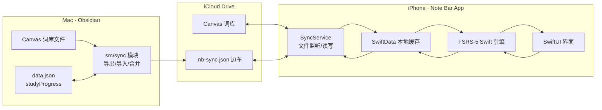

# Note Bar iOS 词汇同步 App 设计文档

> 状态：已与用户逐节确认
> 日期：2026-08-14
> 关联仓库：`note-bar`（Obsidian 插件，`main` 分支）
> 上游调研：`documents/lexis-note-bar-调研报告.md`、`documents/lexis-note-bar-改进报告.md`

## 1. 目标

为 Note Bar 生词本开发一款 iOS 伴生 App：把 Obsidian 端维护的单词（Canvas 词库）同步到 iPhone，支持在手机上复习、学习、听写、浏览与管理单词，并把复习进度双向同步回 Obsidian，使桌面与手机共享同一套 FSRS-5 记忆状态。

## 2. 范围与边界

### 2.1 v1 范围

1. **同步**：单词内容 + FSRS-5 进度双向同步（iCloud Drive 文件通道）。
2. **复习卡片流**：看卡、翻转、评分、发音、今日待复习数量。
3. **学习与复习分离**：首页「开始复习」（到期词）与「开始学习」（新词）两个独立入口。
4. **词库浏览**：按日期 / 首字母 / 熟练度三种分组；单词详情页；手机端添加、删除、编辑单词与释义。
5. **学习统计**：日历视图（点日期看当天单词，点词进详情）、复习热力图、连续天数、每日复习量。
6. **听写模式**：给中文释义拼写英文单词，音标可点击朗读。
7. **设置**：iCloud 目录授权、暗夜模式开关、自动朗读开关、每日新词上限、每轮听写上限、发音源、主题。

### 2.2 非目标（v1 不做）

- 安卓、iPad 专属布局、Apple Watch。
- CloudKit 推送（保留为后续升级路径）。
- 手机端 AI 翻译/划词、本地离线词典打包（词典 363MB，释义已存于 Canvas，App 直接读取）。
- App Store 上架（v1 走 TestFlight；付费开发者账号已确认）。
- 词条关系（词根/近义词）与 cloze 卡面（改进报告 P5 的部分能力，留待后续）。

## 3. 现状

- 插件入口 [src/main.ts](/Users/shengxia/Documents/projects/obisdian-plugin/note-bar/src/main.ts)：加载 `HiWordsSettings`（含 `studyProgress`），初始化 `VocabularyManager`、`MasteredService`、`EncounterTracker`，注册侧边栏、高亮扩展、闪卡/拼写/导出等命令。
- 进度模型：FSRS-5（[src/hiwords/core/fsrs.ts](/Users/shengxia/Documents/projects/obisdian-plugin/note-bar/src/hiwords/core/fsrs.ts)），进度字段 `{ s, d, due, lastReview, reps, lapses }` 存于 `data.json` 的 `studyProgress`，键为 study-key。
- 闪卡会话：[flashcard-queue.ts](/Users/shengxia/Documents/projects/obisdian-plugin/note-bar/src/hiwords/core/flashcard-queue.ts) 已支持 learn-new 与 review-due 两种会话；评分四档 again/hard/good/easy。
- 拼写练习：[spelling-practice-modal.ts](/Users/shengxia/Documents/projects/obisdian-plugin/note-bar/src/hiwords/ui/spelling-practice-modal.ts)，`spellingPractice.maxPerSession` 默认 20。
- Canvas 词库：词条以节点存储，插件有 `canvas-editor.ts`（增删改、按日期分组、`normalizeLayout` 排版）。
- 词典/发音：有道 TTS `https://dict.youdao.com/dictvoice?audio={{word}}&type=2`。

## 4. 数据与文件约定

### 4.1 文件布局

- 用户的 vault 位于 iCloud Drive；每个生词本 Canvas 原样同步。
- 每个 Canvas 词库旁边放一个同名边车文件：`<词库>.canvas` → `<词库>.nb-sync.json`。Obsidian 不解析该文件，不会改动它。
- 边车文件会出现在 Obsidian 文件列表中（vault 内的普通 JSON），可选加 CSS 隐藏，不影响功能。

### 4.2 边车 schema（两端共用，version 1）

```json
{
  "version": 1,
  "book": "英语词库.canvas",
  "words": {
    "<studyKey>": {
      "s": 30.5,
      "d": 5.2,
      "due": "2026-08-15",
      "lastReview": "2026-08-12T09:00:00+08:00",
      "reps": 4,
      "lapses": 0,
      "status": "active",
      "mastered": false
    }
  },
  "log": [
    { "t": "2026-08-12T09:00:00+08:00", "word": "<studyKey>", "grade": 3 }
  ],
  "updatedAt": "2026-08-12T09:00:00+08:00"
}
```

- 单词与释义**以 Canvas 为准**，边车只存进度与日志，避免两份内容打架。
- `due` 为本地日期 `YYYY-MM-DD`（与 `flashcard-algorithm.ts` 的 `toISODate` 一致）；时间戳带时区 ISO 8601。

### 4.3 studyKey

复用插件现有 study-key 生成逻辑（词 + 来源），保证两端识别同一个词。App 端移植同款函数并冻结测试向量。

### 4.4 冲突仲裁

- 同一词两端都复习过：以 `lastReview` 更新者为准。
- 日志按「时间戳 + 词 + 评分」去重后追加，不删除。
- 内容（增删改单词）：以 Canvas 为准；手机端内容操作见 6.9。
- iCloud 产生冲突副本（`xxx.nb-sync.json` 与 `xxx (冲突副本).nb-sync.json`）时，比较 `updatedAt` 取新者，旧的冲突副本改名归档，不静默丢弃。

## 5. 系统架构

### 5.1 总体数据流



### 5.2 Obsidian 插件同步模块

新增 `src/sync/`，不改 FSRS 引擎与 Canvas 编辑逻辑：

- `sidecar-store.ts`：读写/解析/版本校验边车。
- `sync-exporter.ts`：`studyProgress` → 边车（按词库、studyKey 映射），评分保存后触发。
- `sync-importer.ts`：监听 vault 边车 `modify`（防抖 1.5s）→ 与 `data.json` 合并（lastReview 仲裁、log 追加去重）→ 写回 → 刷新 mastered 与 Canvas 颜色。
- 设置页新增「手机同步」分区：总开关、iCloud 目录路径显示、立即导出/导入、冲突日志。

### 5.3 iOS App 分层

- **SyncService**：用户一次性授权 vault 目录（document picker + security-scoped bookmark），读写边车与 Canvas；`NSMetadataQuery` 监听变化。
- **LocalStore**：SwiftData 缓存全部词条与进度，离线可用；评分本地立即生效后再写边车。
- **FSRS Engine**：`fsrs.ts` 的 Swift 逐行移植（19 参数表、init/next、retrievability、nextInterval、humanInterval）。
- **UI**：SwiftUI。

### 5.4 同步时机与限制

- App 前台/启动/手动下拉刷新时拉取并合并；评分后立即本地生效并写边车。
- 插件端用 `fs.watch` + 防抖实时感知手机写入。
- v1 不做后台秒级推送；升级路径为在同一套文件上叠加 CloudKit 变更通知，不动现有结构。

## 6. iOS App 设计

### 6.1 页面清单

底部标签：学习 / 词库 / 统计 / 设置。

1. 首页「学习」：今日待复习/新词数；「开始复习」「开始学习」两个入口；词库卡片（词数、已掌握、待复习数）。
2. 复习卡（见 6.2）。
3. 词库浏览（见 6.4）。
4. 统计（见 6.5）。
5. 听写（见 6.6）。
6. 单词详情：单词 + 音标 + 发音、释义/例句、记忆稳定度条、复习次数、下次到期、编辑/删除。
7. 设置：iCloud 目录授权、暗夜模式、自动朗读、每日新词上限、每轮听写上限、发音源、主题、同步状态与日志。

### 6.2 复习交互

- 卡片加大：满屏宽、高度加大，单词大字号；点击翻转（3D 动画），正面单词+音标+发音，背面释义+例句。
- 四向滑动手势评分（与 FSRS 四档一一对应）：

| 方向 | 评分 | 颜色 |
|---|---|---|
| 左滑 | 认识（good） | 绿 |
| 右滑 | 不认识（again） | 红 |
| 上滑 | 太简单（easy） | 橙 |
| 下滑 | 模糊（hard） | 灰 |

- 文字提示与卡片边缘着色**仅在滑动过程中**出现，松手即评分；按钮区保留「不认识/模糊/认识」三键 + 撤销 + 进度 `3/12`。
- 评分间隔预览（humanInterval）在评分按钮/滑动释放时短暂展示。

### 6.3 学习与复习分离

- 「开始复习」= due ≤ 今天的 active 词；「开始学习」= 无进度新词，受 `dailyNewWordLimit` 限制；默认复习优先。
- 复用插件现有 learn/review 会话语义与 `flashcard` 设置（`newWordSteps`、`dailyReviewLimit`、`studyOrder`）。

### 6.4 词库浏览与熟练度分档

- 分段切换：按日期 / 按首字母 / 按熟练度。
- 列表每行：单词 + 状态标签 + ✎ 编辑按钮（进入编辑页）。
- 熟练度五档由 FSRS 稳定度 `s` 自动映射，不手动打标签：

| 档位 | 判定 |
|---|---|
| 未开始 | 无进度记录 |
| 新学 | `s < 2` |
| 巩固 | `2 ≤ s < 15` |
| 熟悉 | `15 ≤ s < 60` |
| 已掌握 | `s ≥ 60` 或 `mastered=true` 或 `status ∈ {graduated}` |

### 6.5 统计

- 顶部卡片：连续天数、今日复习量。
- 日历视图（默认）：月份网格，有复习/学习的日期着色；点日期展开当天单词列表（含每词评分）；点单词进详情页可继续阅读或编辑。
- 复习热力图（近 18 周）作为日历旁的第二视图，与日历可切换。
- 数据源：边车 `log` 聚合的复习日志。

### 6.6 听写模式

- 出题：显示中文释义（可附词性、例句提示，可隐藏），用户拼写英文；音标按钮点击朗读。
- 「检查」判定对错；每轮上限取自 `spellingPractice.maxPerSession` 设置；完成显示本轮统计。

### 6.7 视觉规范

- 整体 iOS 毛玻璃：SwiftUI 系统材质（`.ultraThinMaterial` 等）+ 背景模糊；iOS 26 设备可升级 Liquid Glass。
- 单词文字：日间模式黑色，夜间模式暗紫色；暗夜模式可在设置中开关。
- 评分四色：绿/红/橙/灰（见 6.2 表），用于滑动边缘与提示。

### 6.8 音频

- 沿用有道 TTS URL 模板；无网络时降级 `AVSpeechSynthesizer`。
- 「自动朗读」开关控制翻面/下一张时是否自动发音。

### 6.9 手机端内容编辑（Canvas 写回策略）

- App 解析 Canvas JSON 读取词条；增删改时直接写 Canvas 节点（与插件同一结构）。
- v1 简化布局：手机端新词按简单网格落位，不移植完整 `normalizeLayout`；桌面插件打开该 Canvas 时用现有排版逻辑自动整理。
- 手机编辑在桌面离线期间仅在 App 本地生效；桌面 Obsidian 运行时由既有 Canvas `modify` 监听自动重载。

## 7. 数据迁移

- 首次开启同步：把 `data.json` 现有 `studyProgress` 一次性导出为首份边车；Canvas 内容零改动。
- App 首启：读边车初始化；无边车按全新词库处理。
- 旧 `reps/ef/interval` 字段（若有历史数据）按插件现有兼容逻辑读取，不重新计算。

## 8. FSRS 一致性保证

- Swift 移植覆盖 `fsrs.ts` 全部常量与函数（`FSRS_W`、`FSRS_DECAY`、`FSRS_FACTOR`、`initStability`、`initDifficulty`、`nextDifficulty`、`retrievability`、`nextRecallStability`、`nextForgetStability`、`nextInterval`、`humanInterval`、`MAX_IVL`）。
- 用 TS 端生成的一组固定测试向量（给定 s/d/间隔天数/评分序列 → 期望 s′/d′/due）在两端对拍，作为回归基线。
- 时区规则：due 一律本地 `YYYY-MM-DD`；跨时区不换算日期。

## 9. 测试策略

- 插件侧：Node 内置 test runner 单元测试覆盖边车序列化、合并仲裁（lastReview 取胜、log 去重、冲突副本处理）。
- iOS 侧：XCTest 覆盖 FSRS 移植对拍与合并逻辑；SwiftUI 预览验证各页面；日历/热力图聚合单测。
- 端到端（真机 + TestFlight）：
  1. vault → 手机拉取 → 评分 → 写边车 → 桌面合并回 `data.json`；
  2. 桌面评分 → 手机下次启动显示新 due；
  3. 两端同时复习同一词的冲突仲裁；
  4. 手机增删改单词 → 桌面 Canvas 更新；
  5. 860 词级词库的启动与滚动性能。

## 10. 里程碑

- M0：Swift FSRS 移植 + 两端测试向量冻结。
- M1：插件 `src/sync/` 导出/导入/合并 + 设置页 + 单元测试。
- M2：iOS 数据层（iCloud 授权、SwiftData、SyncService 合并）。
- M3：iOS 六个页面 + 毛玻璃视觉 + 手势与动画。
- M4：听写模式 + 统计日历/热力图 + 端到端联调。
- M5：TestFlight 分发与验收。

## 11. 风险与对策

| 风险 | 对策 |
|---|---|
| iCloud 同步延迟/冲突副本 | `NSFileCoordinator` 读写、时间戳仲裁、冲突副本改名归档不丢弃 |
| Canvas 格式/排版差异 | App 只按插件同结构读写节点；手机端简化落位，桌面 `normalizeLayout` 兜底 |
| FSRS 移植偏差 | 冻结测试向量两端对拍 + 回归测试 |
| 后台不推送导致手机进度滞后 | v1 前台同步 + 手动刷新；后续叠加 CloudKit 变更通知 |
| 大词库性能 | 列表分页、progress 按需加载、日志聚合缓存 |

## 12. 决策记录（摘要）

1. 同步通道：iCloud Drive 文件同步（备选 CloudKit/自建服务，v1 不采用）。
2. 进度存储：每词库一个 `.nb-sync.json` 边车；内容以 Canvas 为准。
3. 分发：付费开发者账号 + TestFlight。
4. 复习交互：卡片翻转 + 四向滑动 + 三键评分 + 撤销；学习/复习分离。
5. 熟练度：五档自动映射（见 6.4）。
6. 视觉：iOS 毛玻璃材质；单词日间黑/夜间暗紫。
