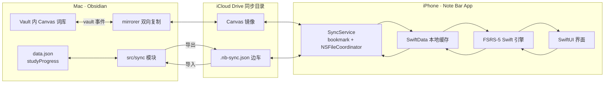

# Note Bar iOS 词汇同步 App 设计文档

> 状态：已与用户逐节确认，并经子代理对照源码审查修订（第 2 版）
> 日期：2026-08-14
> 关联仓库：`note-bar`（Obsidian 插件，`main` 分支）
> 上游调研：`documents/lexis-note-bar-调研报告.md`、`documents/lexis-note-bar-改进报告.md`

## 1. 目标

为 Note Bar 生词本开发一款 iOS 伴生 App：把 Obsidian 端维护的单词（Canvas 词库）同步到 iPhone，支持在手机上复习、学习、听写、浏览与管理单词，并把复习进度双向同步回 Obsidian，使桌面与手机共享同一套 FSRS-5 记忆状态。

## 2. 范围与边界

### 2.1 v1 范围

1. **同步**：单词内容 + FSRS-5 进度双向同步（iCloud Drive 文件通道）。
2. **复习卡片流**：看卡、翻转、评分、发音、今日待复习数量。
3. **学习与复习分离**：首页「开始复习」（到期词）与「开始学习」（新词）两个独立入口。
4. **词库浏览**：按日期 / 首字母 / 熟练度三种分组；单词详情页；手机端添加、删除、编辑单词与释义。
5. **学习统计**：日历视图（点日期看当天单词，点词进详情）、复习热力图、连续天数、每日复习量。
6. **听写模式**：给中文释义拼写英文单词，音标可点击朗读。
7. **设置**：iCloud 目录授权、暗夜模式开关、自动朗读开关、每日新词上限、每轮听写上限、发音源、主题。

### 2.2 非目标（v1 不做）

- 安卓、iPad 专属布局、Apple Watch。
- CloudKit 推送（保留为后续升级路径）。
- 手机端 AI 翻译/划词、本地离线词典打包（词典 363MB，释义已存于 Canvas，App 直接读取）。
- App Store 上架（v1 走 TestFlight；付费开发者账号已确认）。
- 词条关系（词根/近义词）与 cloze 卡面（改进报告 P5 的部分能力，留待后续）。
- 桌面设置与手机设置的自动同步（App 设置独立，见 6.3）。

## 3. 现状（以源码为准）

- 插件入口 [src/main.ts](/Users/shengxia/Documents/projects/obisdian-plugin/note-bar/src/main.ts)：加载 `HiWordsSettings`（含 `studyProgress`），初始化 `VocabularyManager`、`MasteredService`、`EncounterTracker`，注册侧边栏、高亮扩展、闪卡/拼写/导出等命令。
- 进度模型：FSRS-5（[fsrs.ts](/Users/shengxia/Documents/projects/obisdian-plugin/note-bar/src/hiwords/core/fsrs.ts)，19 参数），进度存于 `data.json` 的 `studyProgress`，值类型 `StudyProgressItem`（[types.ts](/Users/shengxia/Documents/projects/obisdian-plugin/note-bar/src/hiwords/utils/types.ts)）。
- `StudyProgressItem` 真实字段（第 2 版以此为准）：

```ts
status: 'new' | 'learning' | 'review' | 'mastered'  // 学习阶段
stage?: number                                      // 学习阶段步进
reps?: number; ef?: number; interval?: number       // SM-2 兼容字段
s?: number; d?: number; lapses?: number             // FSRS
dueDate?: string        // 本地日期 YYYY-MM-DD
lastReview?: string     // ISO 时间戳
history?: { date: string; quality: 'again'|'hard'|'good'|'easy' }[]  // 每词最多 50 条
lifecycle?: 'active' | 'graduated' | 'archived' | 'retired'
pinned?: boolean
masteredAt?: string; updatedAt?: string
```

- studyKey 是**双规则**：
  - 卡片类节点（.hiwords）：`buildStudyKey()` 生成 `语言:类型:规范文本`（[study-key.ts](/Users/shengxia/Documents/projects/obisdian-plugin/note-bar/src/hiwords/utils/study-key.ts)，NFKC + trim + 空白折叠 + 去首尾标点 + `toLocaleLowerCase()`）；
  - Canvas 普通 text/file 节点：**不设 studyKey**，运行时回退为 `${definition.source}:${definition.nodeId}`（[vocabulary-manager.ts](/Users/shengxia/Documents/projects/obisdian-plugin/note-bar/src/hiwords/core/vocabulary-manager.ts) 的 `buildStudyItemCache`），`source` 是 Canvas 文件的 vault 相对路径，`nodeId` 是节点 JSON 的 16 位 hex id。
- Canvas 节点文本模板（[canvas-parser.ts](/Users/shengxia/Documents/projects/obisdian-plugin/note-bar/src/hiwords/canvas/canvas-parser.ts) `parseFromText`）：首行单词；可选第二行别名 `*a, b*`（单个星号包裹）；空行后是释义。
- 添加日期：来自 label 为 `YYYY-MM-DD` 的 group；新词由 `findOrCreateDateGroup` 创建「今天」组（[canvas-editor.ts](/Users/shengxia/Documents/projects/obisdian-plugin/note-bar/src/hiwords/canvas/canvas-editor.ts)）。`normalizeLayout` 只整理**未分组节点**的位置，**不会创建日期组**（[layout.ts](/Users/shengxia/Documents/projects/obisdian-plugin/note-bar/src/hiwords/canvas/layout.ts)）。
- 已掌握检测：'Mastered'/'已掌握' 组，或节点 `color === '4'`；自动毕业阈值 `DEFAULT_GRADUATED_S = 30`（[flashcard-algorithm.ts](/Users/shengxia/Documents/projects/obisdian-plugin/note-bar/src/hiwords/core/flashcard-algorithm.ts)，`s >= 30` 时置 `lifecycle='graduated'`）。
- 闪卡会话：learn-new 与 review-due 两类；评分四档 again/hard/good/easy；每次评分写 `history`（`slice(-50)` 保留最近 50 条，[flashcard-review-modal.ts](/Users/shengxia/Documents/projects/obisdian-plugin/note-bar/src/hiwords/ui/flashcard-review-modal.ts)）。
- 发音：优先词条 `card.audio`（vault 内附件，`app://` 资源路径），否则有道 TTS `type=2`；[tts.ts](/Users/shengxia/Documents/projects/obisdian-plugin/note-bar/src/hiwords/utils/tts.ts)。
- 测试基建：仓库当前无测试框架、无 test script（TS 4.7.4、esbuild 0.28、@types/node 16）。

## 4. 数据与文件约定

### 4.1 文件布局（第 2 版：vault 与 iCloud 目录分离）

用户设定：vault 本身不在 iCloud，只把含单词的 Canvas 词库放进 iCloud。因此设计为一条**镜像链路** + **边车只在 iCloud 目录**：

```text
vault 内（Obsidian 使用）
  <任意路径>/英语词库.canvas
              │  Mac 插件 mirrorer 双向复制（防抖 + 轮询兜底）
              ▼
iCloud Drive 同步目录（用户指定，如 iCloud Drive/NoteBar）
  <与 vault 相同的相对路径>/英语词库.canvas          ← 镜像
  <与 vault 相同的相对路径>/英语词库.nb-sync.json     ← 进度边车（仅存于此）
```

- 镜像目录**保持 vault 相对路径**，保证两端的 `source` 字段一致（studyKey 依赖它）。
- 边车文件**不放 vault**，因此 Obsidian 文件列表中不会出现 JSON 文件。
- 若用户后续把整个 vault 放进 iCloud Drive，可把同步目录直接指到 vault 所在目录，行为不变。

### 4.2 边车 schema（version 1，与 `StudyProgressItem` 一一对应）

```json
{
  "version": 1,
  "book": "english/英语词库.canvas",
  "words": {
    "<studyKey>": {
      "status": "review",
      "stage": 2,
      "reps": 4,
      "ef": 2.5,
      "interval": 9,
      "s": 30.5,
      "d": 5.2,
      "lapses": 0,
      "dueDate": "2026-08-15",
      "lastReview": "2026-08-12T09:00:00+08:00",
      "lifecycle": "active",
      "pinned": false,
      "history": [
        { "date": "2026-08-12T01:00:00.000Z", "quality": "good" }
      ]
    }
  },
  "updatedAt": "2026-08-12T09:00:00+08:00"
}
```

- 字段名、枚举与 `StudyProgressItem` **逐字一致**：`status`（new/learning/review/mastered）、`stage`、`reps/ef/interval`、`s/d/lapses`、`dueDate`、`lastReview`、`lifecycle`（active/graduated/archived/retired）、`pinned`、`history`。
- 不设虚构的 `mastered` 字段，也不设独立全局 `log`；统计由各词 `history` 聚合。
- `quality` 保留字符串枚举；评分到数字的映射为 again=1、hard=2、good=3、easy=4（仅 App 内部使用）。
- `history` 每词最多 50 条（与桌面 `slice(-50)` 一致）；合并规则：按 `(date, quality)` 去重后追加，再保留最新 50 条。
- `dueDate` 为本地日期 `YYYY-MM-DD`（与桌面 `toISODate` 一致）；`date`/`lastReview` 为带时区 ISO 8601。

### 4.3 studyKey 双规则（关键修正）

- **普通 Canvas text/file 节点**：`studyKey = <source>:<nodeId>`。`source` = Canvas 文件在**同步目录中的相对路径**（与 vault 相对路径一致），`nodeId` = 节点 JSON 的 `id`（16 位 hex）。
- **卡片类节点**：`studyKey = buildStudyKey(language, type, normalizedText)`。规范化流程与 [study-key.ts](/Users/shengxia/Documents/projects/obisdian-plugin/note-bar/src/hiwords/utils/study-key.ts) 完全一致；移植时**固定 locale**（`toLocaleLowerCase('en-US')`），并把 i/İ、ı、全角、NFKC 等字符纳入冻结测试向量，规避 Swift `lowercased()` 与 JS `toLocaleLowerCase()` 的语言环境差异。
- 已知行为（v1 如实保留并写入文档与 UI 提示）：
  - Canvas 文件改名/移动后 `source` 变化，旧进度键断裂（桌面现状，不迁移）；
  - 同一词删除后重加会得到新 `nodeId`，旧进度键成为孤儿、进度重置。
- 两端各自实现双规则并在 M0 冻结同一组测试向量对拍。

### 4.4 冲突仲裁

- 进度：同一词两端都复习过时，以 `lastReview` 更新者为准；`history` 按 4.2 规则合并。
- 同一词出现在多个词库时共享同一 studyKey（桌面 `buildStudyItemCache` 合并 sources）：会同时写入多个边车；合并回桌面 `data.json`（全局单份）时按 `lastReview` 取最新一份即可。
- 内容：以 Canvas 为准；两端**同时**编辑同一 Canvas 时，iCloud 会产生冲突副本，v1 不做自动合并，识别后提示人工处理（见 5.4）。
- iCloud 冲突副本命名是 Apple 风格 `<name> 2.ext`（数字后缀），不是 Windows 风格 `(冲突副本)`；识别正则匹配 `<basename> <数字>.nb-sync.json`，比较 `updatedAt` 取新者，旧者改名归档、不静默丢弃。

## 5. 系统架构

### 5.1 总体数据流



### 5.2 Obsidian 插件同步模块

新增 `src/sync/`，不改 FSRS 引擎与 Canvas 编辑逻辑：

- `mirrorer.ts`：vault 内 Canvas ⇄ iCloud 同步目录双向复制。监听 vault `modify`/`rename`/`delete` 与 iCloud 目录变化（`fs.watch` + 周期 stat 轮询兜底），1.5s 防抖，按 mtime/hash 比较决定方向；冲突副本按 4.4 处理。
- `sidecar-store.ts`：边车读写/解析/版本校验。
- `sync-exporter.ts`：`studyProgress` → 边车（按词库归组、studyKey 直接落盘），评分保存后触发。
- `sync-importer.ts`：iCloud 目录边车变化 → 与 `data.json` 合并（4.4 仲裁）→ 写回 → 刷新 mastered 与 Canvas 颜色。
- 设置页新增「手机同步」分区：总开关、同步目录选择、立即导出/导入、冲突日志；macOS 上写 iCloud Drive 目录需授予「完全磁盘访问权限」的提示。

### 5.3 iOS App 分层与文件访问（关键修正）

- **目录授权**：首次用 `UIDocumentPickerViewController(forOpeningContentTypes: [.folder])` 让用户选择 iCloud 同步目录，持久化 **security-scoped bookmark**；启动时恢复访问，bookmark 失效（stale）时引导重新授权。
- **读写**：全部经 `NSFileCoordinator` 协调；写文件一律「临时文件 + rename」原子替换；写边车前重读磁盘一次并合并，避免双写竞态；JSON 解析失败退避重试。
- **变化感知**：**不用 `NSMetadataQuery`**（iOS 上它只能监视 App 自己的 iCloud 容器，不能监视外部授权目录）。改用 `NSFilePresenter` + `NSFileCoordinator` 感知协作写入，并对目录做低频轮询（比较 mtime）兜底；v1 同步时机为 App 前台/启动/手动刷新。
- **LocalStore**：SwiftData 缓存全部词条与进度，离线可用；评分本地立即生效后再写边车。
- **FSRS Engine**：`fsrs.ts` 的 Swift 逐行移植。
- **UI**：SwiftUI。

### 5.4 同步时机与限制

- App：前台/启动/手动下拉刷新拉取合并；评分后本地立即生效并写边车。
- 插件：`fs.watch` + 周期轮询（默认 15s）感知 iCloud 目录变化；`fs.watch` 对尚未物化的 iCloud 文件不可靠，必须保留轮询兜底。
- Canvas 两端同时编辑产生的 `xxx 2.canvas` 冲突副本：不自动合并，App 与插件分别提示用户选择保留版本。
- v1 不做后台秒级推送；升级路径为叠加 CloudKit 变更通知，不动现有文件结构。

## 6. iOS App 设计

### 6.1 页面清单

底部标签：学习 / 词库 / 统计 / 设置。

1. 首页「学习」：今日待复习/新词数；「开始复习」「开始学习」两个入口；词库卡片（词数、已掌握、待复习数）。
2. 复习卡（见 6.2）。
3. 词库浏览（见 6.4）。
4. 统计（见 6.5）。
5. 听写（见 6.6）。
6. 单词详情：单词 + 音标 + 发音、释义/例句、记忆稳定度条、复习次数、下次到期、编辑/删除。
7. 设置：iCloud 目录授权、暗夜模式、自动朗读、每日新词上限、每轮听写上限、发音源、主题、同步状态与日志。

### 6.2 复习交互

- 卡片加大：满屏宽、高度加大，单词大字号；点击翻转（3D 动画），正面单词+音标+发音，背面释义+例句。
- 四向滑动手势评分（与 FSRS 四档一一对应）：

| 方向 | 评分 | 颜色 |
|---|---|---|
| 左滑 | 认识（good） | 绿 |
| 右滑 | 不认识（again） | 红 |
| 上滑 | 太简单（easy） | 橙 |
| 下滑 | 模糊（hard） | 灰 |

- 文字提示与卡片边缘着色**仅在滑动过程中**出现，松手即评分；按钮区保留「不认识/模糊/认识」三键 + 撤销 + 进度 `3/12`。
- 评分间隔预览（humanInterval）在评分按钮/滑动释放时短暂展示。
- `retired`（lifecycle）词**不进复习流**；`pinned` 词正常参与复习。

### 6.3 学习与复习分离（App 设置独立）

- 「开始复习」= `dueDate ≤ 今天` 且 lifecycle 非 graduated/archived/retired 的词；「开始学习」= 无进度新词，受每日新词上限限制；默认复习优先。
- App 端设置**独立、v1 不同步**，默认值与桌面一致：`newWordSteps=2`、`dailyNewWordLimit=20`、`dailyReviewLimit=50`、`studyOrder=review-first`、`spellingPractice.maxPerSession=20`。两端设置不一致时不互相覆盖。

### 6.4 词库浏览与熟练度分档

- 分段切换：按日期 / 按首字母 / 按熟练度。
- 列表每行：单词 + 状态标签 + ✎ 编辑按钮（进入编辑页）。
- 熟练度五档由 FSRS 稳定度 `s` 与 lifecycle 自动映射，不手动打标签：

| 档位 | 判定 |
|---|---|
| 未开始 | 无进度记录 |
| 新学 | `s < 2` |
| 巩固 | `2 ≤ s < 15` |
| 熟悉 | `15 ≤ s < 30` |
| 已掌握 | `s ≥ 30`（`graduatedStabilityThreshold` 默认 30）或 `lifecycle === 'graduated'` 或 `status === 'mastered'` |

### 6.5 统计

- 顶部卡片：连续天数、今日复习量。
- 日历视图（默认）：月份网格，有复习/学习的日期着色；点日期展开当天单词列表（含每词 quality）；点单词进详情页可继续阅读或编辑。
- 复习热力图（近 18 周）作为日历旁的第二视图，与日历可切换。
- 数据源：各词 `history` 聚合。**如实标注数据可得性**：桌面每词只保留最近 50 条，且历史数据从启用同步起才开始进入边车，日历/热力图只能覆盖同步启用后的完整记录。

### 6.6 听写模式

- 出题：显示中文释义（可附词性、例句提示，可隐藏），用户拼写英文；音标按钮点击朗读。
- 「检查」判定对错；每轮上限取自 App 端设置（默认 20，与桌面同默认值）；完成显示本轮统计。

### 6.7 视觉规范

- 整体 iOS 毛玻璃：SwiftUI 系统材质（`.ultraThinMaterial` 等）+ 背景模糊；iOS 26 设备可升级 Liquid Glass。
- 单词文字：日间模式黑色，夜间模式暗紫色；暗夜模式可在设置中开关。
- 评分四色：绿/红/橙/灰（见 6.2 表），用于滑动边缘与提示。

### 6.8 音频

- 桌面 TTS 可能优先使用 vault 内音频附件（`card.audio` → `app://` 资源路径），iOS 无法访问这类资源；App 端**只走有道 TTS URL**（`type=2` 美音 / `type=1` 英音），无网络时降级 `AVSpeechSynthesizer`。
- 「自动朗读」开关控制翻面/下一张时是否自动发音。

### 6.9 手机端内容编辑（Canvas 写回规范）

App 直接读写镜像 Canvas（与插件同一 JSON 结构），并遵守以下硬性规范：

- **节点文本模板**（必须与桌面解析一致）：首行单词；有别名时第二行 `*a, b*`（单个星号包裹、逗号分隔）；空行后为释义。不按此模板写会导致桌面解析失败。
- **新增词必须自建日期组**：`normalizeLayout` 只整理未分组节点、不创建日期组。App 新增节点时按 `findOrCreateDateGroup` 语义创建 label 为「今天」（`YYYY-MM-DD`）的 group（id 为 16 位 hex），新节点放入组内并按 `layoutGroupInner` 语义排位（2 列网格，GROUP_PADDING=24、GAP=12），组位置取最右 group 右侧 +40、y=0。
- 节点 `id` 用 16 位 hex（对应桌面 8 字节随机数）；`color` 为字符串 `'1'..'6'`。
- **原子写**：临时文件 + rename；**保留未知 JSON 字段**（Obsidian 版本演进可能新增字段）；解析失败退避重试。
- 删除/编辑按 `nodeId` 定位；手机编辑在桌面离线期间仅本地生效，桌面 Obsidian 运行后经 mirrorer 同步并触发既有 Canvas `modify` 重载。

## 7. 数据迁移

- 首次开启同步：把 `data.json` 现有 `studyProgress` 一次性导出为首份边车；Canvas 内容零改动。
- 存量数据导出时，已自动毕业/已掌握的状态必须显式落入边车：`s ≥ 30` → `lifecycle='graduated'`；旧 `status='mastered'` 保留原值；`ef/interval/reps` 一并携带（兼容旧 mastered 判定 `reps≥3 && ef≥2.5`）。
- App 首启：读边车初始化；无边车按全新词库处理。

## 8. FSRS 与 studyKey 一致性保证

- Swift 移植覆盖 `fsrs.ts` 全部常量与函数（`FSRS_W`、`FSRS_DECAY`、`FSRS_FACTOR`、`initStability`、`initDifficulty`、`nextDifficulty`、`retrievability`、`nextRecallStability`、`nextForgetStability`、`nextInterval`、`humanInterval`、`MAX_IVL`）。
- studyKey 双规则两端同实现（4.3），`toLocaleLowerCase('en-US')` 固定 locale。
- 用 TS 端生成的一组固定测试向量（FSRS：s/d/间隔/评分序列 → 期望 s′/d′/due；studyKey：普通节点、卡片、中文 concept、短语、i/İ/ı/全角/NFKC）在两端对拍，作为回归基线。
- 时区规则：dueDate 一律本地 `YYYY-MM-DD`；跨时区不换算日期。

## 9. 测试策略

- 插件侧：仓库无测试框架，采用 **esbuild 编译后 `node --test`**（不引入 ts-node/tsx）；覆盖 sidecar 序列化、合并仲裁（lastReview 取胜、history 去重 slice(-50)、冲突副本 `<name> 2` 识别）、studyKey 双规则与 locale 边界、dueDate 时区。
- iOS 侧：XCTest 覆盖 FSRS 移植对拍、合并逻辑、Canvas 节点模板生成（含日期组）、bookmark 恢复失败路径；SwiftUI 预览验证各页面；日历/热力图聚合单测。
- 端到端（真机 + TestFlight）：
  1. vault → mirrorer → iCloud 目录 → 手机拉取 → 评分 → 写边车 → 桌面合并回 `data.json`；
  2. 桌面评分 → 手机下次启动显示新 dueDate；
  3. 两端同时复习同一词的冲突仲裁（lastReview）；
  4. 两端同时编辑同一 Canvas 的冲突副本识别与提示；
  5. 手机新增词（模板 + 日期组）→ 桌面 Canvas 正确解析并按日期分组；
  6. 860 词级词库的启动与滚动性能；
  7. studyKey 对拍：改名/重加节点导致的键断裂行为两端一致。

## 10. 里程碑

- M0：Swift FSRS 移植 + studyKey 双规则 + 两端测试向量冻结。
- M1：插件 `src/sync/`（mirrorer + 导出/导入/合并）+ 设置页 + 单元测试。
- M2：iOS 数据层（目录授权与 bookmark、SwiftData、SyncService 合并）。
- M3：iOS 六个页面 + 毛玻璃视觉 + 手势与动画。
- M4：听写模式 + 统计日历/热力图 + 端到端联调。
- M5：TestFlight 分发与验收。

## 11. 风险与对策

| 风险 | 对策 |
|---|---|
| iCloud 同步延迟/冲突副本 | `NSFileCoordinator` + 原子写 + 时间戳仲裁 + `<name> 2` 副本识别归档不丢弃 |
| vault 与 iCloud 目录内容分叉 | mirrorer 按 mtime/hash 双向复制 + 轮询兜底 + 冲突副本人工确认 |
| studyKey 不一致导致进度错位 | 双规则冻结测试向量两端对拍；改名/重加行为的提示写进 UI |
| Canvas 格式/排版差异 | App 只按插件同结构读写节点；新增词自建日期组并按模板写文本；桌面 normalizeLayout 兜底 |
| FSRS 移植偏差 | 冻结测试向量两端对拍 + 回归测试 |
| 后台不推送导致手机进度滞后 | v1 前台同步 + 手动刷新；后续叠加 CloudKit 变更通知 |
| iCloud 目录授权失效 | security-scoped bookmark 持久化 + stale 检测 + 重新授权引导 |
| 大词库性能 | 列表分页、progress 按需加载、history 聚合缓存 |
| macOS 完全磁盘访问权限 | 设置页显式提示并给出系统设置跳转 |

## 12. 决策记录（摘要，第 2 版）

1. 同步通道：iCloud Drive 文件同步（备选 CloudKit/自建服务，v1 不采用）。
2. 存储拓扑：vault 内 Canvas 经 Mac 插件 mirrorer 双向镜像到 iCloud 同步目录；进度边车**只存 iCloud 同步目录**，不放 vault。
3. 边车 schema 与 `StudyProgressItem` 逐字段一致；统计从每词 `history` 聚合，不设全局 log。
4. studyKey 双规则：普通节点 `source:nodeId`，卡片节点 `buildStudyKey`；固定 en-US locale。
5. iOS 文件访问：document picker + security-scoped bookmark + NSFileCoordinator + NSFilePresenter/轮询（不用 NSMetadataQuery）。
6. 分发：付费开发者账号 + TestFlight。
7. 复习交互：卡片翻转 + 四向滑动 + 三键评分 + 撤销；学习/复习分离；App 设置独立不同步。
8. 熟练度五档：未开始 / 新学 s<2 / 巩固 2≤s<15 / 熟悉 15≤s<30 / 已掌握 s≥30 或 lifecycle=graduated。
9. 手机新增词必须按桌面节点文本模板写入并自建「今天」日期组。
10. 视觉：iOS 毛玻璃材质；单词日间黑/夜间暗紫。
